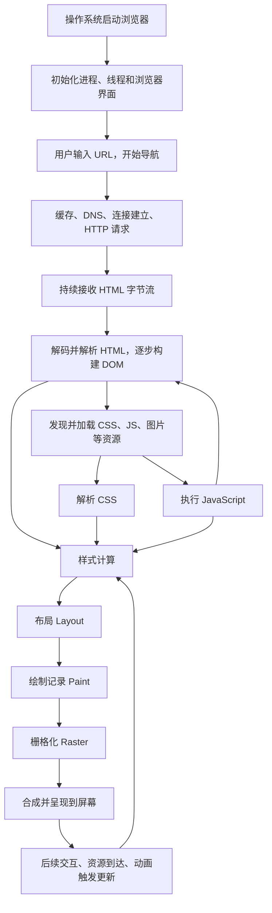

# Principle

Q&A with GPT-6 Astra High, a real good teacher!

## Question

浏览器工作原理，从浏览器启动加载进内存到用户输入地址，dns解析、请求HTML及资源、渲染HTML（流式解析、执行脚本、应用样式、绘制，重绘，重排等）、页面加载完毕（documentLoaded？）全流程讲解

## Answer

你说的 `documentLoaded`，通常指的是 **`DOMContentLoaded`**。它表示 HTML 已解析完成，并且需要在解析后执行的相关脚本已执行；**它不等于所有资源加载完成，也不等于页面已经显示完毕。**

下面以现代 Chromium 浏览器访问 `https://example.com/index.html` 为例，串起整个流程。Firefox、Safari 的实现细节不同，但总体原理相通。

先记住一个贯穿全程的事实：**网络下载、HTML 解析、资源加载和画面更新会交错进行。浏览器可以一边接收 HTML，一边构建 DOM，一边请求资源，并分批显示页面。**



这张图描述的是依赖关系；实际运行时，很多步骤会并行或反复发生。

**先从浏览器程序进入内存说起。** 点击浏览器图标后，操作系统会启动程序，建立进程的虚拟地址空间，映射可执行文件和依赖库，准备线程栈、堆等运行环境，随后执行浏览器的初始化代码。

这里的“加载进内存”通常采用**按需分页**：程序映射到虚拟地址空间后，需要访问的代码和数据页才逐步进入物理内存，并不要求先把整个浏览器安装目录读完。[Linux 内存管理文档](https://www.kernel.org/doc/html/latest/admin-guide/mm/concepts.html)

浏览器随后初始化用户配置、窗口、网络服务、存储服务，以及所需的子进程。现代浏览器通常采用多进程架构：

| 部分 | 主要职责 |
|---|---|
| 浏览器主进程 | 地址栏、标签页、窗口、导航管理、协调其他进程 |
| 网络服务，通常位于独立进程 | DNS、连接管理、HTTP 请求、网络缓存 |
| 渲染进程 | HTML/CSS 处理、页面 JavaScript、布局及部分渲染工作 |
| GPU 进程 | 承担 GPU 相关的栅格化、合成、绘制等工作 |
| 其他辅助进程 | 音视频、存储、扩展等，取决于实现 |

渲染进程内部还会有主线程、合成线程等。**页面 JavaScript 通常运行在渲染进程的主线程上；整个浏览器并不是单线程。**

标签页与渲染进程也不是严格一一对应：一个页面中的跨站 iframe 可能使用另一个渲染进程，进程也可能复用。[Chromium 多进程架构](https://new.chromium.org/developers/design-documents/multi-process-architecture/)

**用户输入地址后，浏览器开始一次“导航”。** 地址栏先判断输入是 URL 还是搜索词，并解析协议、主机名、端口、路径、查询参数等。

例如：

```text
https://example.com:443/products?id=10#details

协议       https
主机名     example.com
端口       443
路径       /products
查询参数   id=10
片段       details
```

`#details` 这部分通常供浏览器在本地定位或供页面脚本使用，不会作为 HTTP 请求目标发送给服务器。

以下主要讨论“加载一个新文档”的导航。只改变同一文档的 `#片段`、某些 SPA 路由切换，以及从往返缓存恢复页面，不一定重新走完整流程。

浏览器还会检查导航策略，例如 HTTPS 升级，并准备合适的渲染进程。**准备渲染进程可以与网络请求同时进行。** 收到响应、确认可以作为文档加载后，浏览器会提交导航，将响应数据流交给渲染进程。[Chrome 导航流程](https://developer.chrome.com/blog/inside-browser-part2)

**真正访问网络之前，还可能直接拿到本地响应。**

常见情况包括：

- HTTP 缓存仍然新鲜：可以直接使用缓存响应。
- 缓存需要验证：发送条件请求，服务器可能返回 `304`，然后复用已有响应体。
- 已有适用的 Service Worker：它可能从 Cache Storage 返回响应，也可能继续访问网络。

HTTP 缓存和 Service Worker 的 Cache Storage 是两套不同机制。`Cache-Control: no-cache` 的含义是复用前需要验证，并非禁止存储；`no-store` 才是要求不存储该响应。[MDN：HTTP 缓存](https://developer.mozilla.org/en-US/docs/Web/HTTP/Guides/Caching)、[Chrome：Service Worker 与导航](https://developer.chrome.com/blog/inside-browser-part2#in-case-of-service-worker)

这些机制使得“每次打开页面都先 DNS、再建立连接”并不成立。

**如果需要新建网络连接，就要先确定连接到哪里。** 对域名而言，主要涉及 DNS 解析。

可以把典型过程理解为：

```text
浏览器或系统的解析缓存
        ↓ 未命中
配置的递归 DNS 解析器
        ↓ 它也没有缓存
根 DNS → 顶级域 DNS → 权威 DNS
        ↓
返回解析结果，并按规则缓存
```

其中，向根、顶级域、权威服务器逐级查询的工作，通常由**递归解析器**完成，浏览器通常只是向解析服务提出请求。中间任何一层命中缓存，都可能省去后续查询。[DNS 基础规范 RFC 1034](https://www.rfc-editor.org/rfc/rfc1034.html)

还需要注意：

- `A` 记录提供 IPv4 地址，`AAAA` 提供 IPv6 地址。
- 一个域名可能对应多个 IP。
- 结果可能指向 CDN 或负载均衡节点。
- 浏览器可能使用系统解析器，也可能使用自己的安全 DNS 配置。
- 因而不能把“浏览器缓存 → 系统缓存 → hosts → 路由器”当作所有环境都固定遵守的顺序。

拿到目标地址后，浏览器选择或建立连接：

| 常见 HTTPS 协议 | 新连接的大致过程 |
|---|---|
| HTTP/1.1、HTTP/2 | TCP 连接建立 → TLS 握手 → 发送 HTTP 请求 |
| HTTP/3 | 建立基于 UDP 的 QUIC 连接，握手集成 TLS 1.3 |

TLS 涉及服务器身份验证、密钥协商等工作。HTTP/3 使用 QUIC，因此不能把所有网页请求都解释为“先 TCP 三次握手”。已有连接也可能直接复用；HTTP/2、HTTP/3 能在一条连接上承载多个请求流。[MDN：HTTP 的演进](https://developer.mozilla.org/en-US/docs/Web/HTTP/Guides/Evolution_of_HTTP)

**连接可用后，浏览器请求 HTML，服务器返回响应。** 用 HTTP/1.1 的文本形式示意：

```http
GET /index.html HTTP/1.1
Host: example.com
Accept: text/html
```

实际还可能携带 Cookie、缓存验证信息等请求头。HTTP/2、HTTP/3 的线上编码形式不同，但请求方法、状态码等语义基本相通。

服务器可能经过 CDN、反向代理、应用服务器等环节，最终返回：

```http
HTTP/1.1 200 OK
Content-Type: text/html; charset=utf-8
Content-Encoding: br

...HTML 响应体...
```

也可能先返回重定向，让浏览器继续请求另一个 URL。

浏览器接收到的首先是字节。网络层处理协议与内容解压后，HTML 处理过程再根据字符编码将字节解码为文本。响应体可以逐段交付，**不必等整个 HTML 下载完成才开始解析**。[MDN：浏览器如何工作](https://developer.mozilla.org/en-US/docs/Web/Performance/Guides/How_browsers_work)

**HTML 的流式解析，就是“输入不断到达，DOM 不断增长”。**

主要过程是：

```text
字节 → 字符 → Token → DOM 节点 → DOM 树
```

例如：

```html
<div class="card">Hello <b>World</b></div>
```

解析器会识别开始标签、属性、文本、结束标签等 Token，再按照 HTML 的树构建规则建立节点。

它还会处理不规范的 HTML，比如补出某些省略的元素、修正某些错误嵌套。因此，最终 DOM 结构不一定与源代码表面上的嵌套完全一致。[HTML 解析规范](https://html.spec.whatwg.org/multipage/parsing.html)

当解析器遇到资源引用，就会安排加载：

```html
<link rel="stylesheet" href="/style.css">
<script src="/app.js"></script>

```

浏览器通常还配有**预加载扫描器**，提前扫描已收到的 HTML，发现后面的资源。即使正式解析器暂时被脚本阻塞，部分资源仍可能提前开始下载。

但扫描器只能发现已有信息：由 JavaScript 运行后才生成的 URL，通常要等代码执行后才能知道。[Chrome：HTML 解析与资源发现](https://developer.chrome.com/blog/inside-browser-part3#parsing)

**CSS 的下载、解析和应用，需要分开理解。**

外部 CSS 返回后，浏览器解析规则，建立可供查询和应用的样式表示，通常称为 **CSSOM**。接着通过选择器匹配、层叠、继承等规则，计算元素应采用的样式。

例如：

```css
.card {
  width: 300px;
  color: red;
}
```

这时能确定 `.card` 的样式，但元素最终放在哪里、文本如何换行，还需要后面的布局步骤。

对于普通、适用于当前媒体条件的页面样式表：

- CSS 下载通常**不会直接停止 HTML 解析**。
- 它通常会**阻塞页面的首次渲染**，避免先显示错误样式再大幅跳变。
- 某些脚本执行还需要等待它前面尚未就绪、会阻塞脚本的样式表。

第三点很容易遗漏。脚本可能读取样式或几何信息，因此浏览器必须满足相关样式依赖。

于是可能形成这样的间接阻塞：

```text
CSS 尚未加载完成
        ↓
后面的普通脚本等待 CSS
        ↓
HTML 解析器等待该脚本
        ↓
后面的 DOM 暂时无法继续构建
```

所以，“CSS 不阻塞 HTML 解析”需要与具体脚本依赖一起理解。[web.dev：阻塞渲染的 CSS](https://web.dev/articles/critical-rendering-path/render-blocking-css)、[MDN：DOMContentLoaded 的依赖](https://developer.mozilla.org/en-US/docs/Web/API/Document/DOMContentLoaded_event)

**JavaScript 如何加载和执行，主要取决于脚本类型。**

下面针对初始 HTML 中由解析器发现的常见脚本：

| 写法 | 下载过程 | 执行时机 | 对 HTML 解析的影响 |
|---|---|---|---|
| `<script>...</script>` | 无外部下载 | 解析器遇到后执行 | 执行期间暂停解析 |
| `<script src="a.js">` | 若资源未就绪，解析器等待 | 资源及相关依赖就绪后执行 | 等待和执行都会停住解析器 |
| `<script defer src="a.js">` | 可与 HTML 解析并行 | HTML 解析完后，按文档顺序执行 | 下载期间不阻塞解析 |
| `<script async src="a.js">` | 可与 HTML 解析并行 | 资源就绪后尽快执行 | 若解析尚未完成，执行会占用主线程、打断解析进度 |
| `<script type="module" src="a.js">` | 加载模块及依赖 | 默认延后到 HTML 解析完成后执行 | 通常类似 `defer`；加 `async` 后行为不同 |

普通脚本需要暂停解析，是因为它能观察和修改当前 DOM，甚至使用 `document.write()` 改变后续解析输入。

`async` 只表示无需让解析器等待下载，**不表示脚本跑到了另一个线程上**；多个 `async` 脚本也不保证按标签顺序执行。`defer` 对普通内联脚本没有作用。[MDN：script 元素](https://developer.mozilla.org/en-US/docs/Web/HTML/Reference/Elements/script)

脚本交给 JavaScript 引擎后，会经历语法处理、字节码生成和执行等阶段，热点代码还可能被优化编译。以 V8 为例，Ignition 是其字节码解释器。[V8：Ignition](https://v8.dev/docs/ignition)

**用一段 HTML，可以把前面的依赖串起来。**

```html
<!doctype html>
<html>
<head>
  <link rel="stylesheet" href="/main.css">
  <script src="/early.js"></script>
  <script defer src="/app.js"></script>
  <script async src="/analytics.js"></script>
</head>
<body>
  <h1>Hello</h1>
  
</body>
</html>
```

假设资源正常加载、没有特殊缓存或策略：

1. 收到 HTML 开头，开始解析并请求 `main.css`。
2. 遇到 `early.js`，正式解析器暂停；脚本还可能等待前面的 `main.css`。
3. 预加载扫描器可能提前发现 `app.js`、`analytics.js`、`hero.jpg`，启动请求。
4. `early.js` 执行完成，正式解析器继续。
5. `app.js` 下载期间不挡解析，等文档解析完后执行。
6. `analytics.js` 就绪后尽快执行，可能发生在解析结束之前，也可能之后。
7. 浏览器在内容、样式和调度条件满足时，可以先显示标题等内容。
8. 图片之后加载完成，再补上图片画面。

这里提前写了图片的宽高，浏览器就能预留对应空间，减少图片到达后引起的布局变化。

**DOM 和样式足够可用时，浏览器就能开始生成画面。** 常见的教学模型是：

```text
DOM + CSSOM
    ↓
样式计算 Style
    ↓
布局 Layout
    ↓
绘制 Paint
    ↓
栅格化 Raster
    ↓
合成 Composite
    ↓
屏幕呈现
```

实际引擎有更多中间结构和阶段，但下面这些职责需要分清。

**样式计算确定“应该长什么样”。** 浏览器根据 CSS 规则，得到元素的计算样式。即使网页没写 CSS，浏览器默认样式表仍然会提供标题字号、块级元素显示方式等默认行为。

**布局确定“放在哪里、有多大”。** 浏览器根据可用空间、字体度量、盒模型、Flex/Grid 等规则，计算元素的几何信息和文本换行。

布局结构与 DOM 不完全相同：

- `display: none` 的元素及其子树不生成布局盒。
- `visibility: hidden` 的元素仍然参与布局，只是不显示自身内容。
- `::before` 等伪元素可以产生布局内容，却不是普通 DOM 元素。
- 一个 DOM 元素也可能产生多个布局片段。

因此，常说的“DOM 和 CSSOM 合成渲染树”适合入门；真实实现会使用布局树、片段树等更细的数据结构。[Chrome：样式与布局](https://developer.chrome.com/blog/inside-browser-part3#style-calculation)

**绘制确定“按什么顺序画什么”。** 在现代 Chromium 中，Paint 主要生成绘制记录，例如背景、边框、文字和图片应如何绘制，并处理遮挡、裁剪等关系。

**栅格化将绘制记录转换成像素。** 页面内容通常按图块处理，浏览器可以优先处理视口内及附近的内容，相关工作可能使用 GPU。

**合成把各部分结果组装成一帧。** 浏览器结合图层、变换、透明度等信息，把页面及其他界面内容合成，最后经过系统显示机制呈现到屏幕。图层不是“一个 DOM 元素一个”，具体划分由浏览器决定。[Chromium RenderingNG 架构](https://developer.chrome.com/docs/chromium/renderingng-architecture)

以上步骤可以在 HTML 尚未全部下载完成时发生。后面到达的内容和资源，会触发后续更新。

**所谓重排和重绘，就是已有页面变化后，重新执行必要的渲染工作。**

“重排”也常叫“回流”，英文一般对应重新进行 Layout；“重绘”对应重新进行 Paint。

| 变化示例 | 典型需要的工作 |
|---|---|
| 改变参与布局元素的宽度、字号，插入影响排版的内容 | 样式计算 → 布局 → 必要的绘制、栅格化与合成 |
| 只改变背景颜色 | 样式计算 → 绘制、栅格化与合成，通常无需布局 |
| 满足条件的 `transform`、`opacity` 动画 | 可以复用已有内容，主要进行合成 |

这是常见路径，具体工作取决于变化是否实际生效，以及浏览器能复用哪些结果。

例如：

```js
box.style.width = "400px";          // 可能改变布局
box.style.backgroundColor = "red"; // 通常只改变绘制结果
```

`transform: translateX(...)` 通常不改变元素在正常文档流中占据的位置，因此不会像改变宽度那样推动相邻元素重新排版。但也不能断言“用了 transform 就一定没有绘制开销”：图层准备、栅格内容是否可复用等仍有影响。[web.dev：渲染性能](https://web.dev/articles/rendering-performance)

另外，**浏览器通常会合并更新，不是每写一次样式就立刻重排一次。**

```js
box.style.width = "400px";
box.style.height = "200px";
box.style.marginLeft = "20px";
```

这些写入可以先标记相关状态失效，等需要更新画面时统一处理。

但是，如果写入后马上读取最新几何值：

```js
box.style.width = "400px";
console.log(box.offsetWidth);
```

浏览器可能必须立刻完成待处理的样式与布局，才能返回正确数值，这叫**强制同步布局**。循环交替读写，就可能造成反复布局，通常称为 layout thrashing。是否触发布局取决于当时有没有待处理的相关变化，并非每次读取 `offsetWidth` 都会重排。[web.dev：避免强制同步布局](https://web.dev/articles/avoid-large-complex-layouts-and-layout-thrashing)

**这些更新由事件循环和渲染调度协调。** 对页面主线程，可以用下面的简化过程理解：

```text
执行一个任务，例如脚本、点击回调
        ↓
执行微任务检查点，例如 Promise 回调
        ↓
在合适的渲染机会更新画面
        ↓
继续处理后续任务
```

这不是“每执行一个任务就必定画一帧”。浏览器会考虑刷新时机、页面可见性以及是否需要更新。

`requestAnimationFrame()` 让回调在后续渲染更新的适当阶段运行，便于动画修改。但回调里做很重的计算仍然会阻塞主线程；持续产生微任务也可能推迟渲染。主线程忙碌时，部分已有的合成动画或滚动仍可能继续，但需要主线程参与的新布局和绘制会受影响。[MDN：事件循环与微任务](https://developer.mozilla.org/en-US/docs/Web/API/HTML_DOM_API/Microtask_guide/In_depth)

**最后回到“页面什么时候算加载完”。这里有多个不同的里程碑。**

| 状态或事件 | 表示什么 | 不代表什么 |
|---|---|---|
| `readyState === "loading"` | HTML 仍在解析 | 页面一定还没有显示内容 |
| `readyState === "interactive"` | HTML 解析完成 | `defer` 等脚本已经全部执行 |
| `DOMContentLoaded` | HTML 解析完成，相关延后执行脚本已按要求处理 | 图片、所有异步任务或业务初始化全部完成 |
| `readyState === "complete"` | 达到文档加载完成状态，即将触发 `load` | 页面以后不会再变化 |
| `window` 的 `load` | 文档及需要等待的依赖资源已结束加载 | 所有业务数据请求、懒加载内容都已完成 |

对于常规文档加载，主要顺序是：

```text
readyState = loading
    ↓
HTML 解析完成
    ↓
readyState = interactive
    ↓
执行 defer 脚本、默认延后执行的模块脚本
    ↓
DOMContentLoaded
    ↓
剩余需要等待的资源结束加载
    ↓
readyState = complete
    ↓
window.load
```

这是文档生命周期顺序，**首次显示内容不固定插在其中某一个位置**。[MDN：readyState](https://developer.mozilla.org/en-US/docs/Web/API/Document/readyState)、[HTML 规范：解析结束后的处理](https://html.spec.whatwg.org/multipage/parsing.html#the-end)

对 `DOMContentLoaded`，还有三个需要记牢的细节：

- 它不以普通图片下载完成为前提。
- 它不会专门等待 `async` 脚本；不过已经开始执行的脚本占用主线程时，事件派发仍可能被推迟。
- 它不会等待脚本启动的所有异步工作。比如 `fetch()`、定时器，以及模块中顶层 `await` 之后的工作，不能笼统认为一定先于它完成。

CSS 也可能通过“阻塞相关脚本”的依赖链，间接延迟这个事件。[MDN：DOMContentLoaded](https://developer.mozilla.org/en-US/docs/Web/API/Document/DOMContentLoaded_event)

`load` 通常会等待样式表、普通图片、相关脚本、非懒加载 iframe 等加载依赖；懒加载资源不在通常的等待范围内。资源加载失败并完成错误处理，也不意味着整个页面永远不能触发 `load`。[MDN：load](https://developer.mozilla.org/en-US/docs/Web/API/Window/load_event)

可以这样监听：

```js
document.addEventListener("DOMContentLoaded", () => {
  console.log("HTML 已解析，相关延后脚本已执行");
});

window.addEventListener("load", () => {
  console.log("文档及需要等待的依赖资源已结束加载");
});
```

如果初始化脚本可能很晚才被加载，避免错过 `DOMContentLoaded`，可以检查状态：

```js
function init() {
  // 操作已经构建好的 DOM
}

if (document.readyState === "loading") {
  document.addEventListener("DOMContentLoaded", init, { once: true });
} else {
  init();
}
```

这保证的是 DOM 已可供操作；如果初始化还依赖其他模块的数据或异步任务，需要另行等待那些依赖。

从用户体验看，“出现第一个内容”通常关注 **FCP**，“主要内容何时出现”通常关注 **LCP**。它们衡量视觉呈现，与 `DOMContentLoaded`、`load` 不是同一件事。一个页面可以早早显示正文，却仍在加载图片；也可以已经触发 `load`，但应用还在等待接口数据。[MDN：浏览器加载与渲染](https://developer.mozilla.org/en-US/docs/Web/Performance/Guides/How_browsers_work)

`load` 之后，浏览器仍持续运行：处理输入、执行脚本、接收数据、播放动画，并根据变化重新计算样式、布局、绘制或合成。因此，业务上的“页面准备好了”，通常需要应用自己定义，例如“首屏数据已返回、组件已挂载、必要交互已就绪”。

